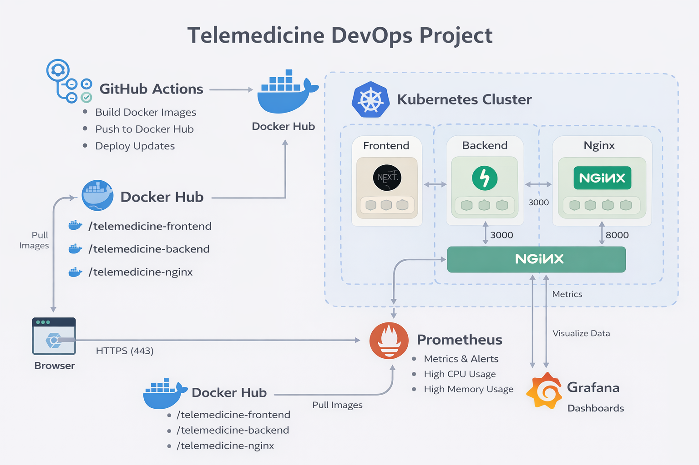
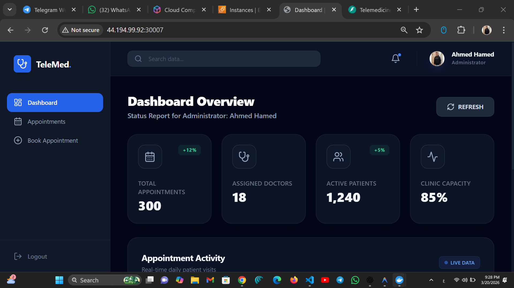
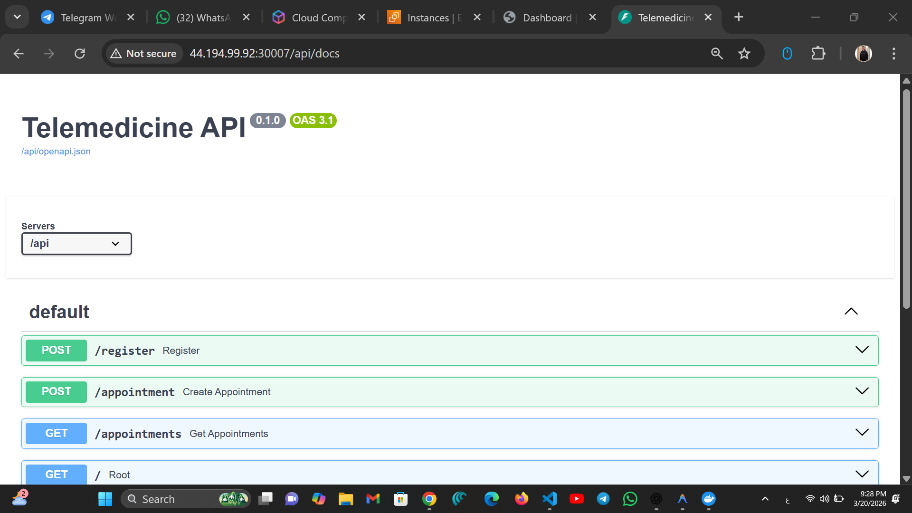
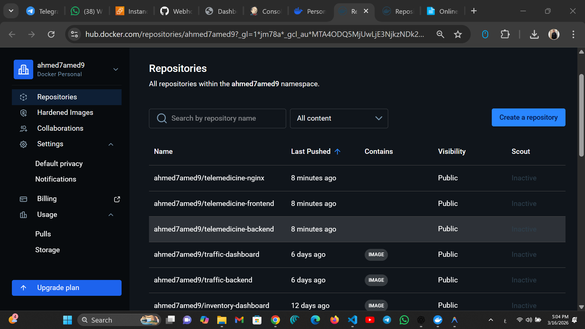
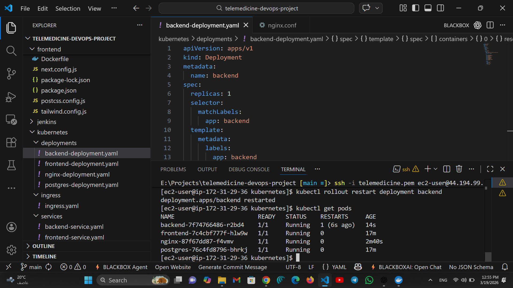
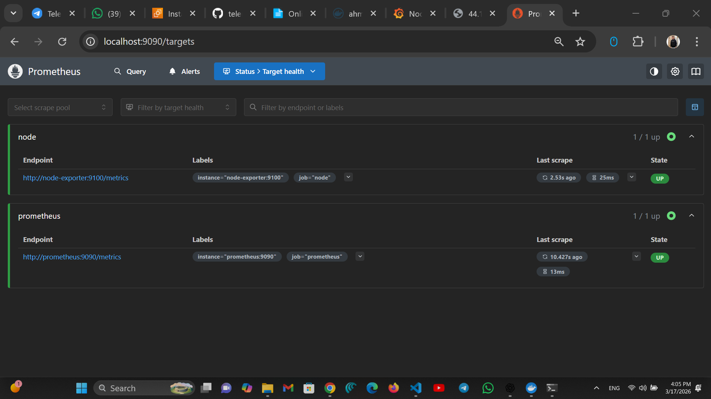
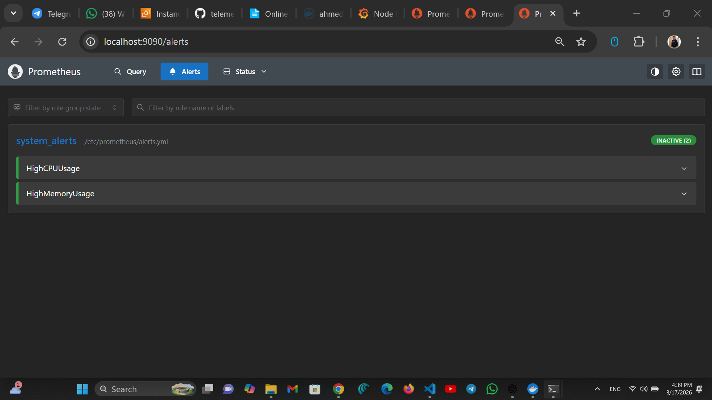
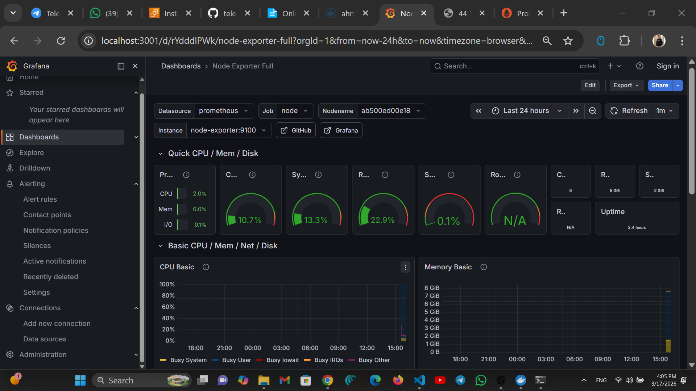

# 🚑 Telemedicine DevOps Project

A full-stack telemedicine system built with **DevOps best practices** including Docker, Kubernetes, CI/CD, and monitoring.

---

## 🏗️ Architecture Diagram



---

## 🚀 Application Overview

### 🖥️ Frontend Dashboard



* Admin dashboard to manage system
* View appointments, doctors, and patients
* Built with **Next.js + Tailwind**

---

### 🔗 Backend API (Swagger)



* REST API using **FastAPI**
* Handles:

  * User registration
  * Appointment creation
  * Fetching appointments

---

## 🐳 Docker & Images



### 🔹 Build & Push Images

```bash
docker build -t ahmed7amed9/telemedicine-backend .
docker push ahmed7amed9/telemedicine-backend

docker build -t ahmed7amed9/telemedicine-frontend .
docker push ahmed7amed9/telemedicine-frontend

docker build -t ahmed7amed9/telemedicine-nginx .
docker push ahmed7amed9/telemedicine-nginx
```

---

## ☸️ Kubernetes Deployment



### 🔹 Apply all configs

```bash
kubectl apply -f kubernetes/
```

### 🔹 Check Pods

```bash
kubectl get pods
```

### 🔹 Restart Deployment

```bash
kubectl rollout restart deployment backend
```

---

## 🔄 CI/CD Pipeline


* Automated pipeline using **GitHub Actions**
* Steps:

  * Build Docker images
  * Push to Docker Hub
  * Deploy updates

---

## 📡 Prometheus Monitoring





* Collects metrics from:

  * Node Exporter
  * Application services

### 🔔 Alerts:

* High CPU Usage
* High Memory Usage

---

## 📊 Grafana Dashboard



* Visual dashboards for:

  * CPU usage
  * Memory usage
  * System performance

---

## 🌐 Access Application

```bash
http://44.194.99.92:30007
```

Swagger:

```bash
http://44.194.99.92:30007/api/docs
```

---

## 👨‍💻 Author

Ahmed Hamed
DevOps Engineer 🚀

---

## ⭐ Notes

This project demonstrates a full **DevOps lifecycle**:

Code → Docker → Kubernetes → CI/CD → Monitoring
